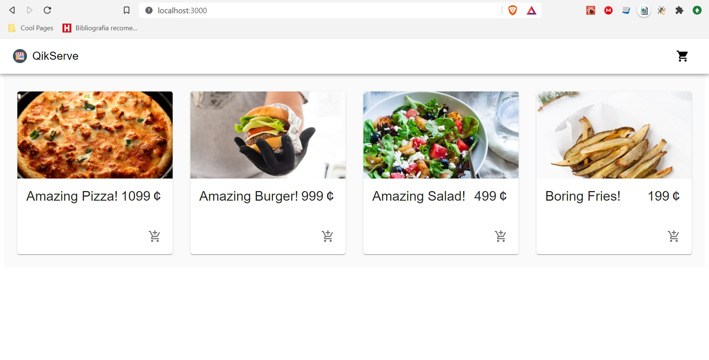

# QikServe-Test

## Project Description
<p align="justify"> E-Commerce Portal and Checkout System </p>

### Ordered List

1. How long did you spend on the test?
2. What would you add if you had more time?
3. How would you improve the product APIs that you had to consume?
4. What did you find most difficult?
5. How did you find the overall experience, any feedback for us?

> Project Status: Concluded :heavy_check_mark:

### Requirements

[Git](https://git-scm.com), [Node.js](https://nodejs.org/en/). 

### 🎲 Running Application

```bash

# Acesse uma nova pasta do projeto no terminal/cmd
$ cd mock-api
$ cd wiremock
$ ./start.sh
$ cd ..
$ cd frontend
$ npm install
$ npm start

```